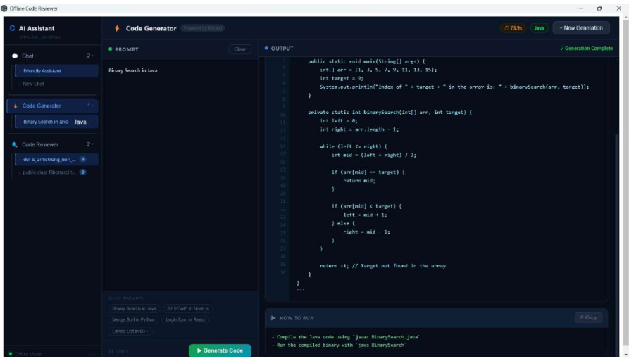
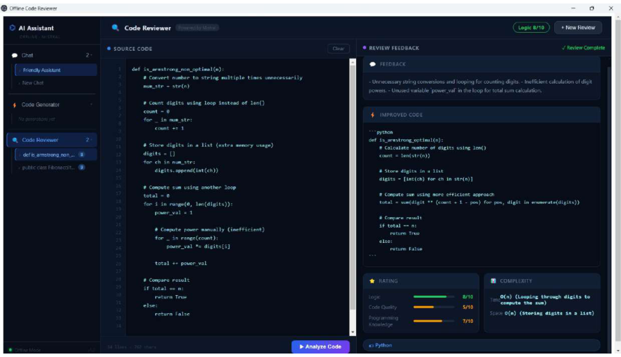
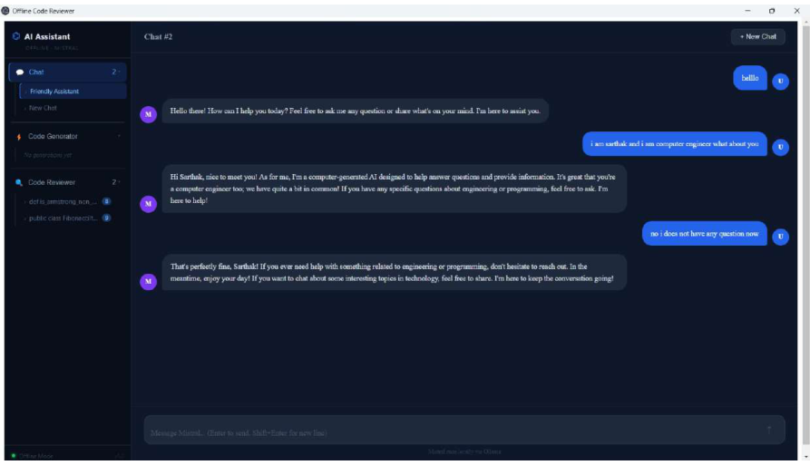

\# AI Code Reviewer


An \*\*offline AI-powered code review application\*\* that helps developers analyze source code, identify potential issues, and receive AI-generated feedback without sending their code to external cloud services.


The application uses \*\*Electron\*\* for the desktop interface, \*\*Express.js\*\* for the backend, and \*\*Ollama\*\* to run the AI model locally.


\## 🚀 Features


\* 🤖 AI-powered source code analysis

\* 🔒 Offline code review using a locally running AI model

\* 💻 Desktop application built with Electron

\* ⚙️ Express.js backend for handling code-review requests

\* 🧠 Local AI inference using Ollama

\* 📝 Code feedback and suggestions

\* 📂 Support for analyzing source code within the application

\* 🖥️ Modern web-based user interface

\* 📊 Review history support

\* 🌐 No dependency on external AI APIs for code analysis


\## 🛠️ Tech Stack


\### Frontend


\* React

\* Vite

\* JavaScript

\* HTML

\* CSS


\### Backend


\* Node.js

\* Express.js


\### Desktop


\* Electron


\### AI


\* Ollama

\* Local Large Language Model (LLM)


\### Development Tools


\* Git

\* GitHub

\* npm


\## 🏗️ Architecture


```text

&#x20;                   ┌─────────────────────┐

&#x20;                   │     Electron App    │

&#x20;                   │                     │

&#x20;                   │   React + Vite UI   │

&#x20;                   └──────────┬──────────┘

&#x20;                              │

&#x20;                              ▼

&#x20;                   ┌─────────────────────┐

&#x20;                   │    Express Server   │

&#x20;                   │                     │

&#x20;                   │  Review API / Logic │

&#x20;                   └──────────┬──────────┘

&#x20;                              │

&#x20;                              ▼

&#x20;                   ┌─────────────────────┐

&#x20;                   │       Ollama        │

&#x20;                   │                     │

&#x20;                   │   Local AI Model    │

&#x20;                   └──────────┬──────────┘

&#x20;                              │

&#x20;                              ▼

&#x20;                   ┌─────────────────────┐

&#x20;                   │   AI Code Review    │

&#x20;                   │                     │

&#x20;                   │ Issues + Suggestions│

&#x20;                   └─────────────────────┘

```


\## 🔄 How It Works


1\. The user provides source code through the application.

2\. The Electron application communicates with the Express backend.

3\. The backend prepares the code-review request.

4\. Ollama processes the request using a locally running AI model.

5\. The AI analyzes the submitted code.

6\. The generated review is returned to the application.

7\. The user can view the review and suggestions through the interface.


\## 📁 Project Structure


```text

AI-Code-Reviewer/

│

├── client/              # React + Vite frontend

│

├── server/              # Express backend

│

├── main.js              # Electron main process

├── preload.js           # Electron preload script

│

├── package.json         # Project dependencies and scripts

├── package-lock.json

├── .gitignore

│

└── README.md

```


\## ⚙️ Prerequisites


Before running the project, make sure you have:


\* Node.js installed

\* npm installed

\* Ollama installed

\* A compatible Ollama model available locally


Check Node.js:


```bash

node --version

```


Check npm:


```bash

npm --version

```


Check Ollama:


```bash

ollama --version

```


\## 📥 Installation


Clone the repository:


```bash

git clone https://github.com/chaitanyapingaleAC/AI-Code-Reviewer.git

```


Navigate to the project:


```bash

cd AI-Code-Reviewer

```


Install dependencies:


```bash

npm install

```


If the frontend has its own dependencies, navigate to the client directory and install them:


```bash

cd client

npm install

cd ..

```


\## 🧠 Ollama Setup


Install Ollama and make sure the required model is available locally.


For example:


```bash

ollama pull <model-name>

```


Then verify the available models:


```bash

ollama list

```


> \*\*Note:\*\* Replace `<model-name>` with the model configured for this project.


\## ▶️ Running the Application


Start the required backend/frontend services according to the scripts configured in `package.json`.


You can check the available scripts using:


```bash

npm run

```


For the Electron application, use the project’s configured Electron start command.


\## 🔐 Why Offline AI?


Traditional cloud-based code-review tools require source code to be sent to remote servers.


This project explores a different approach:


```text

Developer Code

&#x20;     │

&#x20;     ▼

Local Application

&#x20;     │

&#x20;     ▼

Local Express Server

&#x20;     │

&#x20;     ▼

Local Ollama Model

&#x20;     │

&#x20;     ▼

Code Review

```


Because the AI inference is performed locally, the project can be useful when developers want to experiment with AI-assisted code analysis while keeping their source code on their own machine.


\## 🎯 Use Cases


\* Learning and improving programming practices

\* Identifying potential code issues

\* Understanding AI-assisted code review

\* Experimenting with local LLMs

\* Reviewing code without relying on external AI APIs

\* Exploring desktop AI applications


\## 🔮 Future Improvements


\* Support for multiple programming languages

\* More detailed code-quality metrics

\* Security vulnerability detection

\* Performance analysis

\* Code complexity analysis

\* Improved review history and search

\* Support for multiple local AI models

\* Exporting code-review reports

\* Automated test-case suggestions

\* Git/GitHub integration


\## 👥 Contributors


This project was developed as a team project.


\* \*\*Chaitanya Pingale\*\*

\* \*\*Sarthak Titar\*\*


\## 📌 Project Goal


The goal of this project is to combine \*\*software development, desktop application development, backend APIs, and local AI/LLM technology\*\* into a practical developer-focused tool.


\---


## 📸 Screenshots

### Code Generator

Generate code based on a given programming requirement using the AI-powered code generator.



### AI Code Reviewer

Analyze source code and receive AI-generated feedback, suggestions, rating, and complexity information.



### AI Chat

Interact with the locally running AI model through the application's chat interface.




⭐ If you find this project interesting, consider giving the repository a star.


